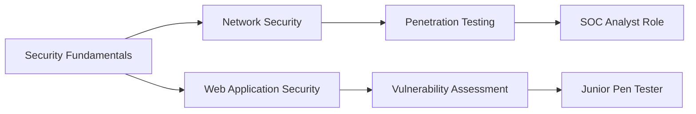

# Hi, I'm Obaid Ullah

<div align="center">

<picture>
  <source media="(prefers-color-scheme: dark)" srcset="https://readme-typing-svg.demolab.com?font=Fira+Code&size=18&duration=3000&pause=1000&color=FF6B6B&background=00000000&center=true&vCenter=true&width=450&lines=Junior+Cybersecurity;Network+Defense+Explorer;Ethical+Hacking+Learner">
  <source media="(prefers-color-scheme: light)" srcset="https://readme-typing-svg.demolab.com?font=Fira+Code&size=18&duration=3000&pause=1000&color=DC2626&background=00000000&center=true&vCenter=true&width=450&lines=Junior+Cybersecurity;Network+Defense+Explorer;Ethical+Hacking+Learner">
  
</picture>

<a href="https://linkedin.com/in/obaidullah-tech" target="_blank">
  
</a>
<a href="mailto:obaid@example.com" target="_blank">
  
</a>
<a href="https://github.com/obaid-git" target="_blank">
  
</a>

</div>

<br>

##  About Me

<picture>
  <source media="(prefers-color-scheme: dark)" srcset="https://raw.githubusercontent.com/Platane/snk/output/github-contribution-grid-snake-dark.svg">
  <source media="(prefers-color-scheme: light)" srcset="https://raw.githubusercontent.com/Platane/snk/output/github-contribution-grid-snake.svg">
  
</picture>

I'm a passionate cybersecurity enthusiast dedicated to protecting digital environments and learning the fundamentals of ethical hacking. Through hands-on practice with platforms like TryHackMe and virtual lab environments, I'm building practical skills in network security, vulnerability assessment, and incident response.

**Current Focus:**
- Building hands-on experience through cybersecurity labs
- Mastering network security fundamentals
- Pursuing industry-standard certifications
- Contributing to open-source security projects

**Career Goals:**
- Junior Penetration Tester or SOC Analyst role
- CompTIA Security+ certification

<br clear="right"/>

##  Certifications & Badges

### Credly Certifications
<div align="center">

<a href="https://www.credly.com/badges/cisco-introduction-to-cybersecurity" target="_blank">
  
</a>
<a href="https://www.credly.com/badges/isc2-candidate" target="_blank">
  
</a>

</div>

### TryHackMe Progress
<div align="center">

<iframe src="https://tryhackme.com/api/v2/badges/public-profile?userPublicId=4183767" style='border:none; width:400px; height:200px;'></iframe>

<a href="https://tryhackme.com/p/obaid.tryhackme" target="_blank">
  
</a>

</div>

### TryHackMe Achievements
<div align="center">

<table>
<tr>
<td align="center" width="20%">

<br><b>cat linux.txt</b>
<br><sub>Linux Fundamentals</sub>
</td>
<td align="center" width="20%">

<br><b>7 Day Streak</b>
<br><sub>Consistent Learning</sub>
</td>
<td align="center" width="20%">

<br><b>3 Day Streak</b>
<br><sub>Regular Practice</sub>
</td>
<td align="center" width="20%">

<br><b>Webbed</b>
<br><sub>Web Security</sub>
</td>
<td align="center" width="20%">

<br><b>Raffle Royalty</b>
<br><sub>Hack2Win 2025</sub>
</td>
</tr>
</table>

</div>

##  Technical Skills

<table>
<tr>
<td valign="top" width="50%">

### Security Tools & Analysis
```bash
# Network Analysis
wireshark --interface=eth0
nmap -sS -O target_ip

# Web Application Testing  
burpsuite --professional
nikto -h target_url
```

### Core Competencies
```yaml
Network Security: Fundamentals, Monitoring
Vulnerability Assessment: Scanning, Analysis  
Ethical Hacking: Reconnaissance, Exploitation
Risk Management: Assessment, Mitigation
```

</td>
<td valign="top" width="50%">

### Operating Systems
```bash
# Linux Security
sudo ufw enable
fail2ban-client status
```

### Security Frameworks
```yaml
NIST Cybersecurity Framework: Identify, Protect
OWASP Top 10: Web Application Security
ISO 27001: Information Security Management
```

</td>
</tr>
</table>

##  Security Analytics

<div align="center">

### **Activity Overview**
<picture>
  <source media="(prefers-color-scheme: dark)" srcset="https://github-readme-activity-graph.vercel.app/graph?username=obaid-git&custom_title=Security%20Learning%20Journey&bg_color=0D1117&color=FF6B6B&line=FF6B6B&point=FF6B6B&area_color=FF6B6B20&title_color=FFFFFF&area=true&hide_border=true">
  <source media="(prefers-color-scheme: light)" srcset="https://github-readme-activity-graph.vercel.app/graph?username=obaid-git&custom_title=Security%20Learning%20Journey&bg_color=FFFFFF&color=DC2626&line=DC2626&point=DC2626&area_color=FEE2E2&title_color=1F2937&area=true&hide_border=true">
  
</picture>

### **Security Focus Areas**
<div align="left">

```yaml
Current Learning Path:
  Network Security: Wireshark, Nmap, Network Protocols
  Web Security: OWASP Top 10, Burp Suite, SQL Injection
  System Security: Linux Hardening, Access Controls
  Incident Response: Log Analysis, Forensics Basics
  Penetration Testing: Reconnaissance, Vulnerability Assessment
```

</div>

### **GitHub Statistics**
<p align="center">
  <picture>
    <source 
      srcset="https://github-readme-stats-sigma-five.vercel.app/api?username=obaid-git&show_icons=true&theme=dark&include_all_commits=true&count_private=true&hide_border=true&bg_color=0D1117&title_color=FFFFFF&text_color=C9D1D9&icon_color=FF6B6B"
      media="(prefers-color-scheme: dark)"
    />
    <source
      srcset="https://github-readme-stats-sigma-five.vercel.app/api?username=obaid-git&show_icons=true&theme=default&include_all_commits=true&count_private=true&hide_border=true&bg_color=FFFFFF&title_color=1F2937&text_color=374151&icon_color=DC2626"
      media="(prefers-color-scheme: light)"
    />
    
  </picture>
</p>

</div>

##  Learning Path

<div align="center">



</div>

##  What Sets Me Apart

<table>
<tr>
<td width="33%" align="center">

**Hands-On Learning**
<br>
Practical experience through virtual labs, CTF challenges, and real-world scenarios

</td>
<td width="33%" align="center">

**Security-First Mindset**
<br>
Always thinking about threats, vulnerabilities, and defensive strategies

</td>
<td width="33%" align="center">

**continuous Growth**
<br>
Committed to staying current with emerging threats and security technologies

</td>
</tr>
</table>

---

<div align="center">

### Open to Opportunities
**Seeking entry-level cybersecurity positions, internships, and mentorship opportunities**

<a href="https://linkedin.com/in/obaidullah-tech" target="_blank">
  
</a>
<a href="https://tryhackme.com/p/obaid.tryhackme" target="_blank">
  
</a>

<picture>
  <source media="(prefers-color-scheme: dark)" srcset="https://komarev.com/ghpvc/?username=obaid-git&style=flat&color=FF6B6B&label_color=0D1117">
  <source media="(prefers-color-scheme: light)" srcset="https://komarev.com/ghpvc/?username=obaid-git&style=flat&color=DC2626&label_color=FFFFFF">
  
</picture>

</div>

---

<div align="center">
<sub>Building secure digital environments, one vulnerability at a time</sub>
</div>
