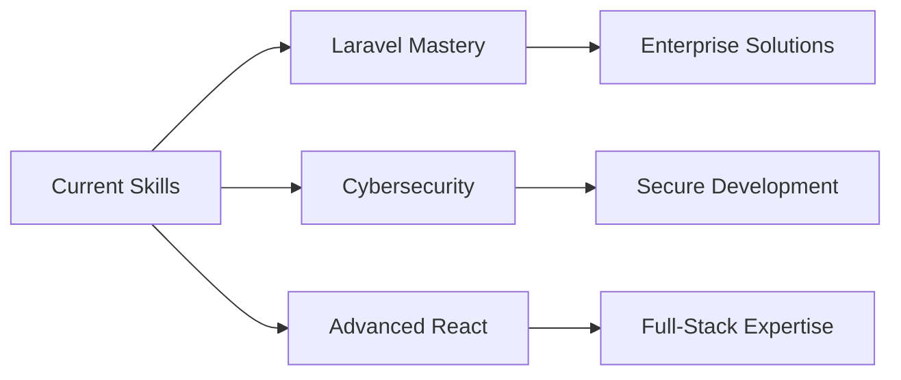

<picture>
  <source media="(prefers-color-scheme: dark)" srcset="https://readme-typing-svg.demolab.com?font=Fira+Code&size=22&duration=4000&pause=500&color=FF8C42&background=00000000&center=true&vCenter=true&width=435&lines=Hi%2C+I'm+Obaid+Ullah;Frontend+Developer;WordPress+Expert;Cybersecurity+Enthusiast">
  <source media="(prefers-color-scheme: light)" srcset="https://readme-typing-svg.demolab.com?font=Fira+Code&size=22&duration=4000&pause=500&color=E85D04&background=00000000&center=true&vCenter=true&width=435&lines=Hi%2C+I'm+Obaid+Ullah;Frontend+Developer;WordPress+Expert;Cybersecurity+Enthusiast">
  
</picture>

<div align="center">

[](https://obaid.live)
[](mailto:obaid_ullah@aol.com)
[](https://www.linkedin.com/in/obaidullah-developer/)

</div>

<br>

##  About Me

<picture>
  <source media="(prefers-color-scheme: dark)" srcset="https://raw.githubusercontent.com/platane/snk/output/github-contribution-grid-snake-dark.svg">
  <source media="(prefers-color-scheme: light)" srcset="https://raw.githubusercontent.com/platane/snk/output/github-contribution-grid-snake.svg">
  
</picture>

I'm a passionate full-stack developer with expertise in modern web technologies and a strong focus on creating scalable, user-centric applications. Currently expanding my knowledge in cybersecurity while building innovative solutions.

**Current Focus:**
- 🚀 Building a comprehensive [Freelancing Platform](https://freelance.obaid.live)
- 🔐 Advancing cybersecurity skills and security-first development
- 📚 Mastering Laravel and CodeIgniter for robust backend solutions
- 🎯 Creating seamless user experiences with modern frontend frameworks

**Professional Interests:**
- Full-stack web development
- WordPress custom development & optimization
- Application security and best practices
- Performance optimization and scalability

<br clear="right"/>

##  Technical Expertise

<table>
<tr>
<td valign="top" width="50%">

### Frontend Development
```javascript
const frontend = {
  languages: ['JavaScript', 'HTML5', 'CSS3'],
  frameworks: ['React', 'Vue.js'],
  styling: ['Tailwind CSS', 'Bootstrap', 'SASS'],
  tools: ['Vite', 'Webpack', 'Figma']
}
```

### Mobile Development
```dart
const mobile = {
  framework: 'Flutter',
  language: 'Dart',
  platforms: ['iOS', 'Android'],
  state_management: ['Provider', 'Bloc']
}
```

</td>
<td valign="top" width="50%">

### Backend Development
```php
const backend = {
  languages: ['PHP', 'JavaScript', 'Python'],
  frameworks: ['Laravel', 'CodeIgniter', 'Node.js'],
  cms: ['WordPress', 'Custom Solutions'],
  security: ['Authentication', 'Authorization', 'Data Protection']
}
```

### Database & DevOps
```sql
const infrastructure = {
  databases: ['MySQL', 'PostgreSQL', 'MongoDB'],
  tools: ['Docker', 'Git', 'Linux'],
  cloud: ['Digital Ocean', 'AWS Basics']
}
```

</td>
</tr>
</table>

##  GitHub Analytics

<div align="center">

### **Activity Overview**
<picture>
  <source media="(prefers-color-scheme: dark)" srcset="https://github-readme-activity-graph.vercel.app/graph?username=obaid-git&custom_title=Obaid's%20GitHub%20Activity%20Graph&bg_color=0D1117&color=FF8C42&line=FF8C42&point=FF8C42&area_color=FF8C4220&title_color=FFFFFF&area=true&hide_border=true">
  <source media="(prefers-color-scheme: light)" srcset="https://github-readme-activity-graph.vercel.app/graph?username=obaid-git&custom_title=Obaid's%20GitHub%20Activity%20Graph&bg_color=FFFFFF&color=E85D04&line=E85D04&point=E85D04&area_color=FFF3E0&title_color=1F2937&area=true&hide_border=true">
  
</picture>

### **Statistics & Insights**
<p align="center">
  <picture>
    <source 
      srcset="https://github-readme-stats-sigma-five.vercel.app/api?username=obaid-git&show_icons=true&theme=dark&include_all_commits=true&count_private=true&hide_border=true&bg_color=0D1117&title_color=FFFFFF&text_color=C9D1D9&icon_color=FF8C42"
      media="(prefers-color-scheme: dark)"
    />
    <source
      srcset="https://github-readme-stats-sigma-five.vercel.app/api?username=obaid-git&show_icons=true&theme=default&include_all_commits=true&count_private=true&hide_border=true&bg_color=FFFFFF&title_color=1F2937&text_color=374151&icon_color=E85D04"
      media="(prefers-color-scheme: light)"
    />
    
  </picture>
  
  <picture>
    <source 
      srcset="https://github-readme-stats-sigma-five.vercel.app/api/top-langs/?username=obaid-git&layout=compact&langs_count=8&theme=dark&hide_border=true&bg_color=0D1117&title_color=FFFFFF&text_color=C9D1D9"
      media="(prefers-color-scheme: dark)"
    />
    <source
      srcset="https://github-readme-stats-sigma-five.vercel.app/api/top-langs/?username=obaid-git&layout=compact&langs_count=8&theme=default&hide_border=true&bg_color=FFFFFF&title_color=1F2937&text_color=374151"
      media="(prefers-color-scheme: light)"
    />
    
  </picture>
</p>

### **Contribution Streak**
<p align="center">
  <picture>
    <source media="(prefers-color-scheme: dark)" srcset="https://streak-stats.demolab.com?user=obaid-git&theme=dark&hide_border=true&date_format=M%20j%5B%2C%20Y%5D&background=0D1117&ring=FF8C42&fire=FF8C42&currStreakLabel=FFFFFF&currStreakNum=FF8C42&sideLabels=C9D1D9&sideNums=FF8C42&dates=8B949E">
    <source media="(prefers-color-scheme: light)" srcset="https://streak-stats.demolab.com?user=obaid-git&theme=default&hide_border=true&date_format=M%20j%5B%2C%20Y%5D&ring=E85D04&fire=E85D04&currStreakLabel=1F2937&currStreakNum=E85D04&sideLabels=374151&sideNums=E85D04&dates=6B7280&background=FFFFFF">
    
  </picture>
</p>

### **GitHub Trophies**
<p align="center">
  <picture>
    <source media="(prefers-color-scheme: dark)" srcset="https://github-profile-trophy.vercel.app/?username=obaid-git&theme=onedark&no-frame=true&row=1&column=6">
    <source media="(prefers-color-scheme: light)" srcset="https://github-profile-trophy.vercel.app/?username=obaid-git&theme=flat&no-frame=true&row=1&column=6">
    
  </picture>
</p>

### **Development Focus**
```yaml
Most Active In: JavaScript, PHP, CSS
Primary Frameworks: Laravel, React, WordPress  
Development Style: Full-stack, Security-focused
Contribution Pattern: Consistent, Project-driven
```

</div>

##  Featured Projects

<div align="center">

### 🚀 Freelancing Platform
**Full-stack web application** • Laravel, MySQL, Vue.js
> A comprehensive platform connecting freelancers with clients, featuring secure payments, project management, and real-time communication.

[**Live Demo**](https://freelance.obaid.live) • [**View Code**](https://github.com/obaid-git/freelancing-platform)

---

### 🌐 Portfolio Website  
**Responsive web design** • HTML5, CSS3, JavaScript
> Modern, responsive portfolio showcasing projects and skills with optimized performance and accessibility.

[**Visit Site**](https://obaid.live) • [**View Code**](https://github.com/obaid-git/portfolio)

</div>

##  Professional Skills

<div align="center">

### Core Technologies
<picture>
  <source media="(prefers-color-scheme: dark)" srcset="https://skillicons.dev/icons?i=html,css,js,php,laravel,react,vue,flutter,mysql,git&theme=dark">
  <source media="(prefers-color-scheme: light)" srcset="https://skillicons.dev/icons?i=html,css,js,php,laravel,react,vue,flutter,mysql,git&theme=light">
  
</picture>

### Development Tools
<picture>
  <source media="(prefers-color-scheme: dark)" srcset="https://skillicons.dev/icons?i=vscode,figma,docker,linux,postman,bootstrap,tailwind,nodejs,mongodb,postgres&theme=dark">
  <source media="(prefers-color-scheme: light)" srcset="https://skillicons.dev/icons?i=vscode,figma,docker,linux,postman,bootstrap,tailwind,nodejs,mongodb,postgres&theme=light">
  
</picture>

### Specialized Platforms
<picture>
  <source media="(prefers-color-scheme: dark)" srcset="https://skillicons.dev/icons?i=wordpress&theme=dark">
  <source media="(prefers-color-scheme: light)" srcset="https://skillicons.dev/icons?i=wordpress&theme=light">
  
</picture>


</div>

##  What Sets Me Apart

<table>
<tr>
<td width="33%" align="center">

**🎨 Design-First Approach**
<br>
Strong eye for UI/UX design with focus on user experience and modern aesthetics

</td>
<td width="33%" align="center">

**🔒 Security Mindset**
<br>
Implementing security best practices from development to deployment

</td>
<td width="33%" align="center">

**📈 Performance Focus**
<br>
Optimizing applications for speed, scalability, and maintainability

</td>
</tr>
</table>

##  Current Learning Path



---

<div align="center">

### Open to Opportunities
**Available for freelance projects, full-time positions, and collaborative ventures**

[](https://obaid.live)
[](https://www.upwork.com/freelancers/obaidupwork)

<picture>
  <source media="(prefers-color-scheme: dark)" srcset="https://komarev.com/ghpvc/?username=obaid-git&style=flat&color=FF8C42&label_color=0D1117">
  <source media="(prefers-color-scheme: light)" srcset="https://komarev.com/ghpvc/?username=obaid-git&style=flat&color=E85D04&label_color=FFFFFF">
  
</picture>

</div>

---

<div align="center">

<picture>
  <source media="(prefers-color-scheme: dark)" srcset="https://readme-typing-svg.demolab.com?font=Fira+Code&size=14&duration=3000&pause=1000&color=8B949E&background=00000000&center=true&vCenter=true&width=300&lines=Built+with+%E2%9D%A4%EF%B8%8F+and+attention+to+detail">
  <source media="(prefers-color-scheme: light)" srcset="https://readme-typing-svg.demolab.com?font=Fira+Code&size=14&duration=3000&pause=1000&color=6B7280&background=00000000&center=true&vCenter=true&width=300&lines=Built+with+%E2%9D%A4%EF%B8%8F+and+attention+to+detail">
  
</picture>

</div>
