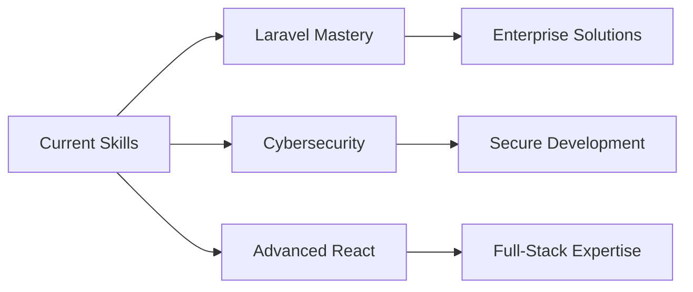

# Hi, I'm Obaid Ullah

<div align="center">
  
**Frontend Developer • WordPress Expert • Cybersecurity Enthusiast**

[](https://obaid.live)
[](mailto:obaid_ullah@aol.com)
[](https://www.linkedin.com/in/YOUR-LINK)

</div>

<br>

## About Me


I'm a passionate full-stack developer with expertise in modern web technologies and a strong focus on creating scalable, user-centric applications. Currently expanding my knowledge in cybersecurity while building innovative solutions.

**Current Focus:**
- 🚀 Building a comprehensive [Freelancing Platform](https://freelance.obaid.live)
- 🔐 Advancing cybersecurity skills and security-first development
- 📚 Mastering Laravel and CodeIgniter for robust backend solutions
- 🎯 Creating seamless user experiences with modern frontend frameworks

**Professional Interests:**
- Full-stack web development
- WordPress custom development & optimization
- Application security and best practices
- Performance optimization and scalability

<br clear="right"/>

## Technical Expertise

<table>
<tr>
<td valign="top" width="50%">

### Frontend Development
```javascript
const frontend = {
  languages: ['JavaScript', 'HTML5', 'CSS3'],
  frameworks: ['React', 'Vue.js'],
  styling: ['Tailwind CSS', 'Bootstrap', 'SASS'],
  tools: ['Vite', 'Webpack', 'Figma']
}
```

### Mobile Development
```dart
const mobile = {
  framework: 'Flutter',
  language: 'Dart',
  platforms: ['iOS', 'Android'],
  state_management: ['Provider', 'Bloc']
}
```

</td>
<td valign="top" width="50%">

### Backend Development
```php
const backend = {
  languages: ['PHP', 'JavaScript', 'Python'],
  frameworks: ['Laravel', 'CodeIgniter', 'Node.js'],
  cms: ['WordPress', 'Custom Solutions'],
  security: ['Authentication', 'Authorization', 'Data Protection']
}
```

### Database & DevOps
```sql
const infrastructure = {
  databases: ['MySQL', 'PostgreSQL', 'MongoDB'],
  tools: ['Docker', 'Git', 'Linux'],
  cloud: ['Digital Ocean', 'AWS Basics']
}
```

</td>
</tr>
</table>

## GitHub Analytics

<div align="center">


<br><br>


</div>

## Featured Projects

<div align="center">

### 🚀 Freelancing Platform
**Full-stack web application** • Laravel, MySQL, Vue.js
> A comprehensive platform connecting freelancers with clients, featuring secure payments, project management, and real-time communication.

[**Live Demo**](https://freelance.obaid.live) • [**View Code**](https://github.com/obaid-git/freelancing-platform)

---

### 🌐 Portfolio Website  
**Responsive web design** • HTML5, CSS3, JavaScript
> Modern, responsive portfolio showcasing projects and skills with optimized performance and accessibility.

[**Visit Site**](https://obaid.live) • [**View Code**](https://github.com/obaid-git/portfolio)

</div>

## Professional Skills

<div align="center">

### Core Technologies


### Development Tools


### Specialized Platforms


</div>

## What Sets Me Apart

<table>
<tr>
<td width="33%" align="center">

**🎨 Design-First Approach**
<br>
Strong eye for UI/UX design with focus on user experience and modern aesthetics

</td>
<td width="33%" align="center">

**🔒 Security Mindset**
<br>
Implementing security best practices from development to deployment

</td>
<td width="33%" align="center">

**📈 Performance Focus**
<br>
Optimizing applications for speed, scalability, and maintainability

</td>
</tr>
</table>

## Current Learning Path



---

<div align="center">

### Open to Opportunities
**Available for freelance projects, full-time positions, and collaborative ventures**

[](https://obaid.live)
[](https://freelance.obaid.live)


</div>

---

<div align="center">
<sub>Built with ❤️ and attention to detail</sub>
</div>
